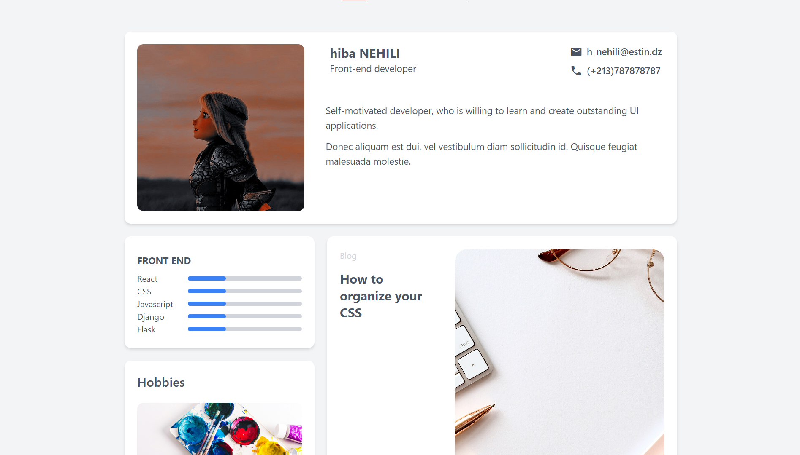

<!-- Please update value in the {}  -->

<h1 align="center">Portfolio Chanllenge</h1>

   Solution for a challenge from  <a href="http://devchallenges.io" target="_blank">Devchallenges.io</a>.

  <h3>
    <a href="https://hibounashi.github.io/portfolio-challenge/">
      Demo
    </a>
     | 
    <a href="https://github.com/hibounashi/my-portfolio/blob/main/index.html">
      Solution
    </a>
     | 
    <a href="https://legacy.devchallenges.io/challenges/5ZnOYsSXM24JWnCsNFlt">
      Challenge
    </a>
  </h3>

<!-- TABLE OF CONTENTS -->

## Table of Contents

- [Overview](#overview)
- [Built With](#built-with)
- [Features](#features)
- [Contact](#contact)
- [Acknowledgements](#acknowledgements)

<!-- OVERVIEW -->

## Overview

In this challenge, I applied all that I knew in CSS to make the page smooth for the viewer i mastered the most used element in tailwind CSS, and using this tech helped me to see a massive increase in my productivity. at the end, I hosted my demo using Google Drive and the DriveToWeb website.

### Built With

<!-- This section should list any major frameworks that you built your project using. Here are a few examples.-->

- [HTML](https://developer.mozilla.org/en-US/docs/Web/HTML)
- [Tailwind CSS](https://tailwindcss.com/)

## Features

<!-- List the features of your application or follow the template. Don't share the figma file here :) -->

This application/site was created as a submission to a [DevChallenges](https://devchallenges.io/challenges) challenge. The [challenge](https://devchallenges.io/challenges/xobQBuf8zWWmiYMIAZe0) was to build a homepage layout.

## How to Use

1. Clone the repository: `git clone https://github.com/your-username/your-repo-name.git`
2. Open the project in your preferred code editor.
3. Explore the files and make modifications as needed.

## Contact

- Website [COMING SOON](https://{your-web-site-link})
- GitHub [@hibounashi](https://github.com/hibounashi)

## Acknowledgements

- [Tailwind CSS](https://tailwindcss.com/)
- [W3Schools](https://www.w3schools.com/)
